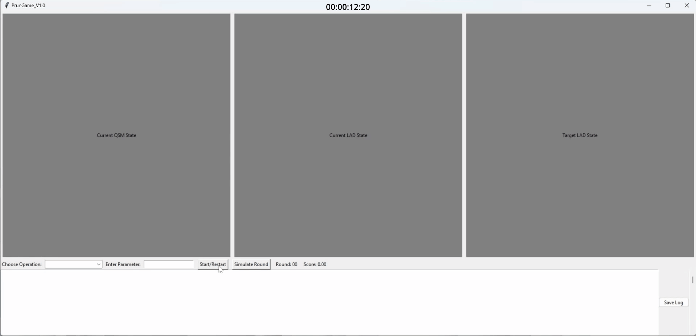
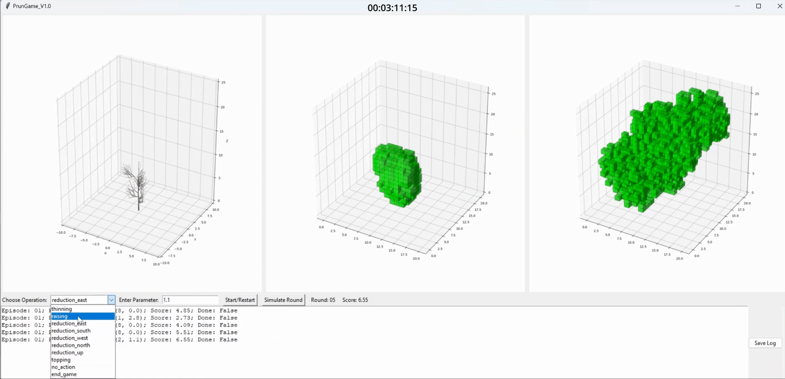
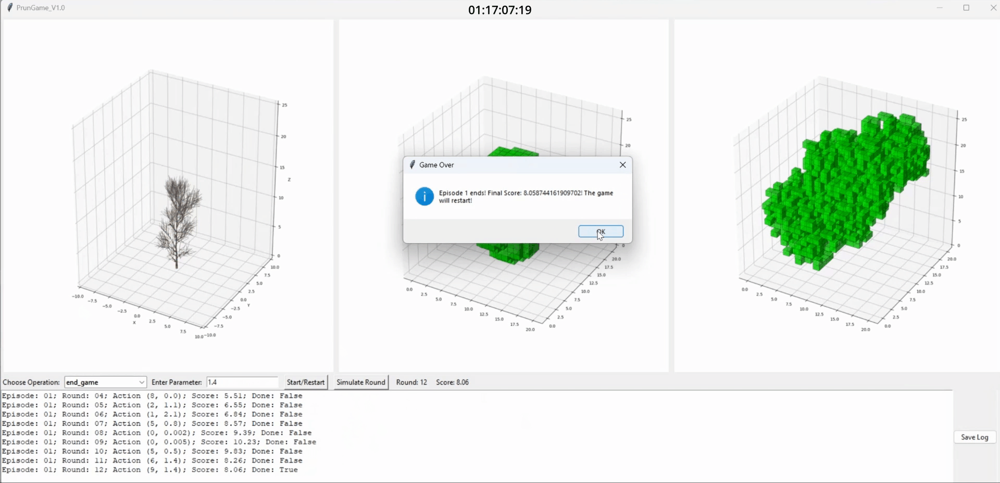

## About The Project

1. Folder Structure
    ```bash
    ├── README.md                         (guidance instruction)
    ├── LICENSE                           (Creative Commons Attribution 4.0 International Public License)
    ├── requirement.txt                   (required libraries in the environment)
    ├── BranchPrunGame_V1.py              (first tree growth game version with user interface)
    ├── BranchPrunGame_V2_binary.py       (a simplified tree growth game version with only binary voxels, user interface embeded)
    ├── main_V1.py                        (deep reinforcement learning in playing BranchPrunGame_V1)
    ├── main_V2_binary.py                 (deep reinforcement learning in playing BranchPrunGame_V2_binary)
    ├── dependency                        (required model and data for BranchPrunGame_V1)
        ├── OptQSM_R1016_P1to7.csv        (QSMs of 7 young plane trees at a nursery)
        ├── HGBRegression_preLAD_3MainIndex.joblib (regression model to predict LAD based on QSM)
        └── std_scaler_preLAD_3MainIndex.bin (the scaler cooresponding to the regression model to predict LAD based on QSM)
    ├── src
        ├── config.py                     (selecting neural network and hyperparameters)
        ├── logger.py
        ├── prunEnv_V1.py                 (embeded BranchPrunGame_V1 for deep reinforcement learning)
        ├── prunEnv_V2_binary.py          (embeded BranchPrunGame_V2_binary for deep reinforcement learning)
        └── trainer.py                    (setting action space)
    ├── utilities                         (fundamentals for deep reinforcement learning)
        ├── __init__.py
        ├── memory.py
        └── utilities.py
    ├── agents                            (setup of a PDQN network)
        ├── __init__.py
        ├── base_agent.py
        ├── net.py
        └── pdqn.py
    └── img                               (images for this instruction)
    ```

<!-- GETTING STARTED -->
## Getting Started

Please follow the instructions below to (i) setup the environment, and (ii) run the respective programs for training and/or inference.

### Prerequisites
Ensure that the following are already installed in your system
* pip
* conda
* pytorch
* numpy
* pandas

### Installation
To install the branch pruning game, please follow these steps:
1. Clone the repo
   ```sh
   git clone https://github.com/QiguanShu/Branch-Pruning-Game-on-Urban-Trees.git
   ```
2. Install dependencies
    * With pip
    ```sh
    pip install requirement.txt
    ```
    or

    * Setup a new conda environment, please refer: https://conda.io/projects/conda/en/latest/user-guide/getting-started.html (recommended if installing with pip might conflict with user's existing packages):
    ```sh
    conda install requirement.txt
    ```

### Run the Game

1. To run the first version of the tree growth game following branch pruning:

    ```sh
    BranchPrunGame_V1.py
    ```

When the game starts correctly, you will see such a user interface.


Click on the "Start/Restart" button to start the game. Then you are able to choose a pruning type and given a parameter to this pruning type. Confirm your choice by clicking on "Simulate Round" button.


If you choose "end_game" in the option, and click on the "Simulate Round", the pruning game will be over.


This version is still not very efficient in running. A video demonstration is uploaded to Youtube: https://youtu.be/vt_yLawogDA
If your computer could not run the version above, you could still try the simplified version below. This will also help you to have a basic understanding of what this pruning game is about.

2. To run the simplified tree growth game without QSM and only with binary voxels:

    ```sh
    BranchPrunGame_V2_binary.py
    ```


### Run the Deep Reinforcement Learning in Playing the Game

1. To run the DRL in full version of the game:

    ```sh
    python main_V1.py
    ```

2. To run the DRL in the simplified version of the game with binary voxels:

    ```sh
    python main_V2_binary.py
    ```

### Authors and Acknowledgment

This project is carried out by:
- **[Qiguan Shu](https://github.com/QiguanShu)**
- **[KaiZhe Boey](https://github.com/kzboey)**

The source code here were served as part of a research project named Urban Green System 4.0 funded by the German Research Foundation under No. DFG-GZ: LU2505/2-1.
For More Information, please check our publication: https://papers.ssrn.com/sol3/papers.cfm?abstract_id=4927534
